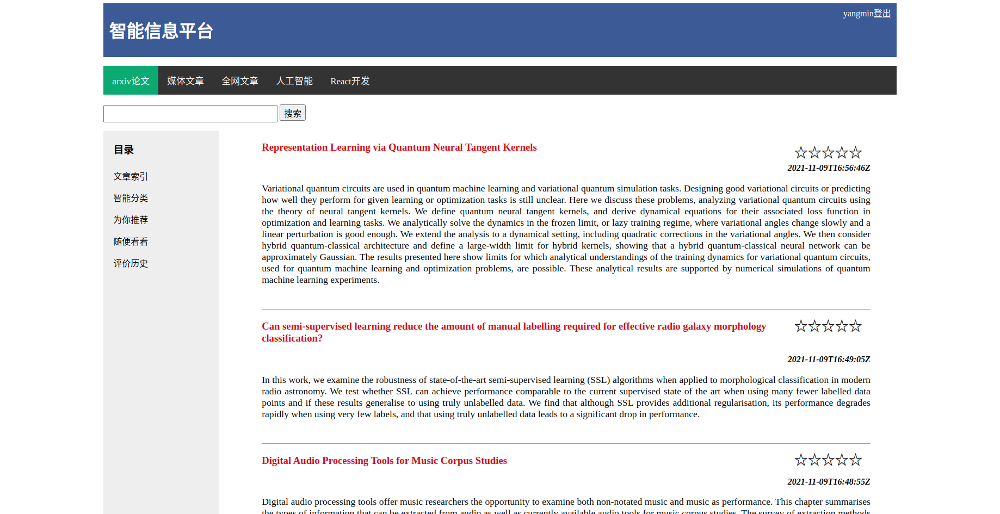
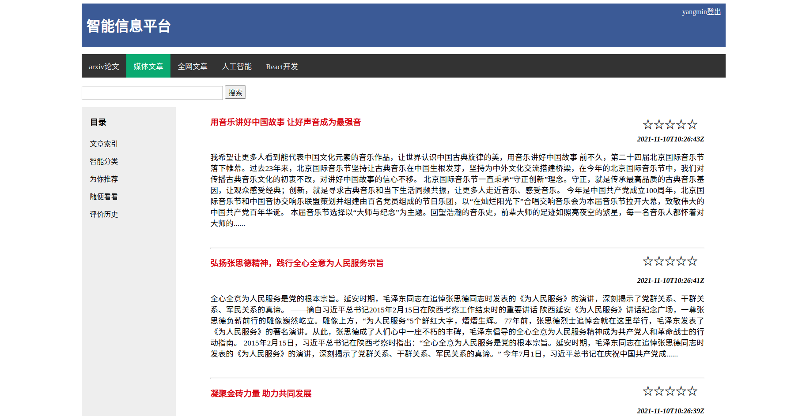
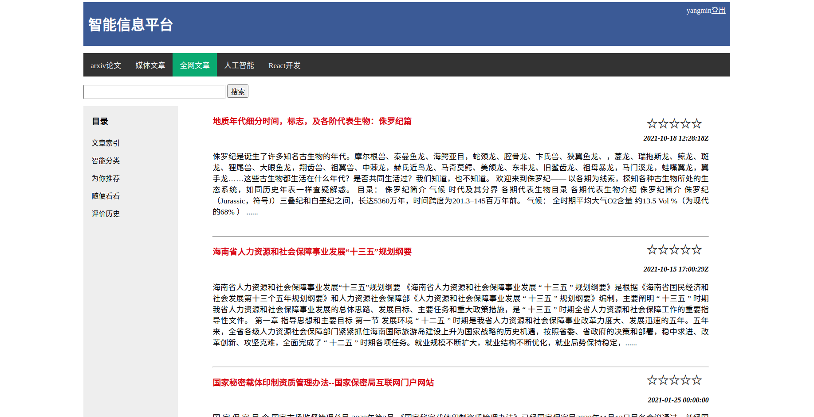
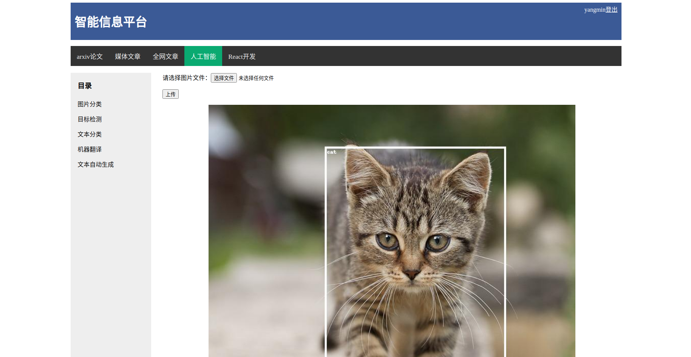

# readpaper
注：该项目尚未成型，目前没有足够的时间去开发，日后有机会再作进一步的开发。

## 项目简介
该项目搭建了一个网站平台，提供信息浏览的功能，AI测试的功能。

平台上的信息是通过爬虫获取，爬到的网页通过网页正文自动提取算法提取出正文信息然后存入库中，平台显示的就是提取出的正文。

浏览平台上的文章时可以对每篇文章做出评价，用户可以看到每篇文章的平均评分，而且平台会根据评价情况推荐用户可能感兴趣的文章。

## 网站截图

### 学术论文

### 权威媒体发文

### 全网随机爬取文章

### 人工智能测试

